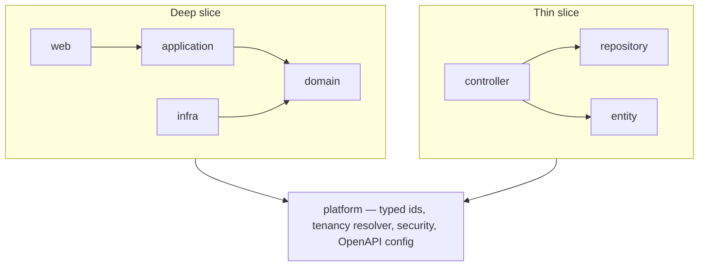
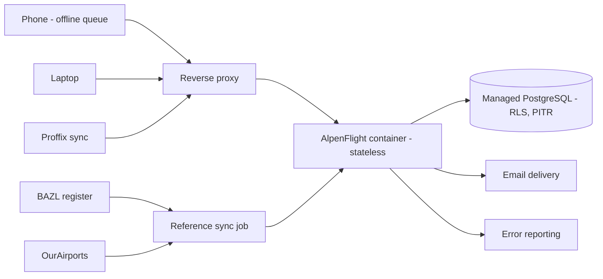
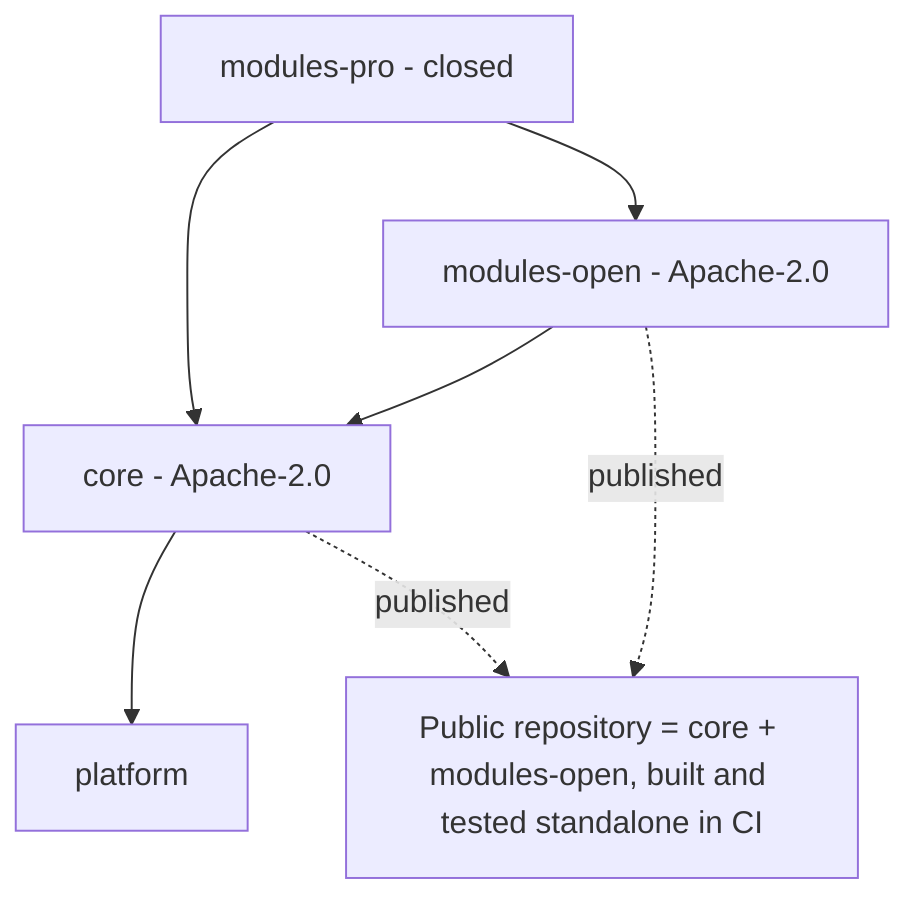

# Architecture Spine — AlpenFlight

## Design Paradigm

**A modular monolith of vertical slices at two depths.**

Organise by feature, never by layer. Each slice owns its entity, its persistence, its endpoints, and its rules. A slice declares one of two depths, and the depth decides its internal shape.

A **thin slice** is four files and carries no business rule:

```text
aircraft/
  Aircraft.java             # JPA entity
  AircraftRepository.java   # extends JpaRepository
  AircraftDto.java          # record, materialised by a projection
  AircraftController.java
```

A **deep slice** carries four packages with an enforced dependency direction:

```text
flight/
  domain/       # aggregate, value objects, domain events, repository interface. No Spring web, no Jackson.
  application/  # use-case services, wire DTOs, mappers
  web/          # controllers, exception translation
  infra/        # Spring Data implementations, external adapters
```

Expected split across the 56 legacy entities: 6–8 deep, ~45 thin.



Cross-slice access runs through a published interface or a domain event. A direct reach into another slice's internals fails the build.

## Invariants & Rules

### AD-1 — Slice depth is thin by default and deep only on a trigger

- **Binds:** all
- **Prevents:** uniform ceremony over ~45 ruleless entities, which is the overhead attempt 1 carried under ADR-0023; and the reverse, business logic hiding in a thin controller.
- **Rule:** A slice is **deep** when it has any of: a state machine; an invariant spanning more than one record; money; a legacy behaviour that must be reproduced exactly. Otherwise it is **thin**. A thin slice carries **no** business rule — the moment it needs one it is promoted to deep. A thin slice must not contain an `application/` package; a deep slice must contain all four.

### AD-2 — Tenant isolation is enforced in the database, and the query layer is only ergonomics

- **Binds:** FR-1, FR-2, FR-8, SM-4, R1, RK-3, RK-12; every table
- **Prevents:** a forgotten club filter returning another club's rows — the defect the legacy carries in `AuditLogsController`, `DashboardService`, and `FlightService.GetFlights`.
- **Rule:** Every club-scoped table has a PostgreSQL row-level-security policy plus `FORCE ROW LEVEL SECURITY`. The application connects as a non-owner role and cannot bypass its own policies. The session variable is set once, in the transaction opener. Repository-level scoping is additive convenience and is never the guarantee. A query that omits the filter returns **zero rows**.

### AD-3 — There are no shared writable entities

- **Binds:** FR-1, FR-2, RK-12, RK-13; the data model
- **Prevents:** a free club writing a row a paying club reads; one club deleting a record another club still uses; the legacy's three contradictory tenancy mechanisms returning in a new form.
- **Rule:** Every table is exactly one of three kinds. **System reference** — supplier-owned, writable by none, readable by every *authenticated* principal; a public surface reads only an explicitly published subset, never the whole table. **Club-scoped** — one club, RLS-enforced. **Cross-club link** — a row the owning club creates, such as a `ClubMembership`. A table that declares no kind fails the build. `OwnerId` and `OwnershipType` are replaced by a plain `club_id` foreign key, never ported.

### AD-4 — A person is visible only through a club membership

- **Binds:** FR-2, FR-84, NFR-3, RK-13
- **Prevents:** any club enumerating the members of another club — a personal-data exposure independent of the free plan, because the system holds names, addresses, licences, and medical expiry.
- **Rule:** A club reads a person only through a `ClubMembership` it owns. There is no global person search. A cross-club crew member is added by an explicit link, never by a typeahead over every person.

### AD-5 — Reference data carries no personal data

- **Binds:** NFR-3, FR-83, FR-84; the reference-sync slice
- **Prevents:** republishing the home addresses of private aircraft owners to every club. The Swiss register's owner columns carry a full name and postal address, and 62% of glider-family aircraft are owned by a private person.
- **Rule:** A reference import drops every owner, operator, and billing column at the reader, before the canonical model. No reference table has a column naming a person. `Aircraft Address` is the ICAO 24-bit code and is not a postal address.

### AD-6 — The application server holds no state

- **Binds:** all; NFR-4, RK-10, Q-B24
- **Prevents:** one builder parking a session in memory while another writes a singleton scheduler, which turns a second instance into a rewrite instead of a configuration change.
- **Rule:** No in-process session, no in-memory cache a request depends on, no local file the next request needs, no in-process scheduler that assumes it runs alone. Every scheduled job takes a database lock before it runs and is idempotent under re-run.

### AD-7 — A schema or API change ships as expand-contract, never as one deploy

- **Binds:** all; the deploy path
- **Prevents:** a migration that makes the running version fail — the failure a second node replicates rather than prevents.
- **Rule:** Deploy N adds the column and writes both. Deploy N+1 reads the new one. Deploy N+2 drops the old. An API field is never removed or re-typed in the deploy that starts writing its replacement.

### AD-8 — Version tolerance lives in the client queue, not in the server

- **Binds:** FR-35–FR-40; the offline store, the service worker
- **Prevents:** a permanent compatibility layer accumulating in the server, and a stale client silently writing a shape the server no longer understands.
- **Rule:** The offline queue is versioned and the **client** migrates it after an upgrade, before it sends. Every write carries its client version. The server accepts the current version and one back, and rejects anything older with a typed error. The client upgrades and retries automatically. The client reloads when it detects a new server version, except while a person edits a form.

### AD-9 — An offline conflict is field-level, and a fundamental field escalates it

- **Binds:** FR-38, FR-39; the flight slice
- **Prevents:** a dialog for two people who did not disagree, and a silent merge of two edits that cannot coexist.
- **Rule:** Two devices changing different fields of one record both apply. The same field changed differently raises a conflict dialog naming both authors and both values. A change to a **fundamental field** — one that reshapes the record — escalates to a whole-record conflict. The fundamental set is closed and declared once, **on the server, and served to the client** — the client never keeps its own copy. The person whose write arrives second resolves it. While a conflict is open the **server value stands and the flight bills on it**; the conflict waits in an open list.

### AD-10 — A stamp is idempotent and never conflicts

- **Binds:** FR-20–FR-26, UJ-1, SM-2
- **Prevents:** wrapping the hot path in conflict machinery, which destroys the speed budget — one of the two capabilities the PRD says decide whether the product succeeds.
- **Rule:** The NOW press on the airborne row and the landing stamp are idempotent. The first stamp wins and the second is a no-op. A stamp never raises a dialog. Two people stamping do not disagree; they state the same intent twice.

### AD-11 — A queued write is parked at 24 hours, never deleted

- **Binds:** FR-35–FR-40
- **Prevents:** destroying a value a person typed, and applying a stale write by surprise.
- **Rule:** A queued write that has not reached the server within 24 hours stops applying by itself. It becomes a pending item showing the field, the value, and the entry time, with Apply and Discard, and it is reported at the next sign-in. Apply is offered only while the API still accepts that shape; otherwise the system shows the values and the person re-enters them. An unsynced write exists only on the device that made it.

### AD-12 — Three module tiers, and the standalone build is the enforcement

- **Binds:** all; the build, the licence headers, the directory layout
- **Prevents:** a pro dependency leaking into core, which would make the community edition unbuildable without anyone noticing until release.
- **Rule:** **Core** — Apache-2.0, both editions. **Open module** — Apache-2.0, optional, both editions; the SaaS ships it pre-installed, which is a distribution difference and never a code difference. **Pro module** — closed source, SaaS only. Core must never reference a pro module. CI builds and tests **core plus the open modules standalone on every commit**. A repository split is not the enforcement; a green standalone build is.

### AD-13 — One tenancy mechanism, always on, in both editions

- **Binds:** AD-2, AD-3; both editions
- **Prevents:** an isolation defect hiding in whichever code path gets less testing.
- **Rule:** A community install holds exactly one club row and runs the same isolation code the SaaS runs. There is never a single-tenant mode, a bypass flag, or a second query path.

### AD-14 — Money is exact, and the type system enforces it

- **Binds:** NFR-1, FR-47–FR-60, SM-1; the charging and invoicing slices
- **Prevents:** a rounding difference that breaks the migration's promise that a club's invoices reproduce to the cent.
- **Rule:** Every monetary and counter value is `BigDecimal` in Java and `numeric` in PostgreSQL. No binary floating-point type appears in any accounting path, in any DTO, or in any JSON payload that carries money. A CI rule fails the build on a `double` or `float` in a charging, delivery, or invoice type.

### AD-15 — The migration is a pipeline with a replaceable source reader

- **Binds:** FR-71–FR-78; the migration module
- **Prevents:** an FLS-shaped importer, which makes every later source a rewrite rather than a new reader.
- **Rule:** Source reader → canonical import model → validation → load. The source reader is the only source-specific part. Everything downstream of the canonical model is shared by every source. The reader maps an aircraft or a location to a reference row where the identity matches, and falls back to a club-scoped row where it does not.

### AD-16 — Availability is a cap on one outage, not a yearly percentage

- **Binds:** NFR-4, NFR-13; hosting and operations
- **Prevents:** meeting an annual figure with one long outage, and buying node redundancy that does not shorten repair time.
- **Rule:** No single outage exceeds **one hour** during the flying window. The annual figure is 99.4%. Planned maintenance is excluded. The offline bridge is sized to the same one hour. The application node is **disposable**: it holds no data, the database is separate and managed with point-in-time recovery, and every part of the node is in code so a rebuild is one command.

### AD-17 — A data list is one component with two renderings, and never a table element

- **Binds:** every list surface; NFR-2, NFR-6
- **Prevents:** a table that cannot reflow on a phone, and forty screens each solving the narrow layout differently.
- **Rule:** `RecordList` holds `RecordItem`, and every list surface in the product uses that pair — logbook, airborne board, invoice drafts, members, aircraft, reports. No `<table>` element is used for a data list. One `RecordItem` definition renders **stacked** on a narrow viewport and as **aligned zones** on a wide one, using CSS grid; dense mode drops it from 60px to 44px. It carries table roles when the data is tabular, and labels each field when it renders stacked. `EXPERIENCE.md` and `DESIGN.md` own the anatomy — identity, meta, metric, marker.

### AD-18 — The interface floor is legibility, not conformance

- **Binds:** NFR-6, NFR-7, NFR-8; every screen
- **Prevents:** one builder adding focus rings and another removing them, and an unbounded conformance programme nobody asked for.
- **Rule:** Signed-in application: every action reachable by keyboard in visual order, a visible focus ring never removed, the `DESIGN.md` contrast floor, no state carried by colour alone — `AIRBORNE`, `LOCKED`, and `UNSENT` each carry a word — and every error tied to its field. No formal WCAG conformance claim, no screen-reader optimisation, no live-region tuning. Public surfaces: WCAG 2.2 AA in full, unchanged, because a stranger on an unknown device uses them.

### AD-19 — REST with OpenAPI, and the generated type is the client's type

- **Binds:** all endpoints; the client
- **Prevents:** a second API style for one maintainer to keep, and a hand-written client model that re-states every field a fourth time.
- **Rule:** The API is REST. `/api/v1/deliveries/*` keeps its wire path, because an external consumer polls it. The server publishes an OpenAPI specification; the client generates its TypeScript from it and uses the generated type **as the component's type**. A thin slice has no client service layer: `httpResource` supplies the value, loading, and error state in one declaration.

### AD-20 — One image, one node, everything in code

- **Binds:** deployment, environments, operations; both editions
- **Prevents:** a deployment shape a volunteer cannot install, and a SaaS that costs more to run than it earns.
- **Rule:** One container image serves the API and the built client. Docker Compose plus PostgreSQL is the supported install path for both editions; Kubernetes is permitted and never required. The image is stateless so several containers may run at once. Every store, backup, and log stays in Switzerland or the EU. Every unhandled error and every failed job is pushed to the supplier and never requires a database query to discover.



## Consistency Conventions

| Concern | Convention |
| --- | --- |
| Naming | `domain-model.md` is the authority. One word, one meaning. A synonym is a defect, and so is a collision with a name already in use. `Status` for a lookup, `State` for a state machine. No abbreviation in an identifier. A rename is applied everywhere in one pass — documents, tokens, identifiers, and this spine together. See `CLAUDE.md` directive 3. |
| Package layout | By feature, never by layer. `platform/` holds the only cross-cutting code every slice may depend on. |
| Ids | One id strategy across every table. The template epic fixes the type; every slice copies the skeleton. |
| Money and counters | `BigDecimal` and `numeric`. Never a binary floating-point type. |
| Dates and times | Stored with an explicit zone. A time-gate boundary states its zone and its inclusivity. |
| The clock | A `Clock` is injected. No code calls `now()` directly, so both time gates are drivable in a test without touching the system clock. |
| Collections | One list envelope and one pagination shape for every collection endpoint. `RecordList` consumes exactly one shape. |
| Deletion | Soft delete is the default for every business record. A hard delete happens only in a named erasure path under FR-83 and FR-84. |
| Concurrency | Every mutable entity carries a version column. A concurrent update returns a typed conflict, never a silent overwrite. |
| Offline scope | The device holds the flight write path, today's flights, the airborne board, and the 13 catalogs the flight form prefetches. Everything else needs a connection. |
| Errors | One error shape across every endpoint. A domain exception is translated to HTTP in `web/`, never thrown from `domain/` with an HTTP annotation. |
| Tenancy | Set once in the transaction opener. Never in a controller, a service, or a query. |
| Migrations | Flyway. Expand-contract. The same migration generates the RLS policy for a new club-scoped table. |
| Jobs | Database lock, then idempotent execution. Never an in-process scheduler. |
| Logging | No personal data in a log line or an error record. |
| Language | Every text a person reads is ASD-STE100, in German and English. German is the source language. |

## Stack

| Name | Version |
| --- | --- |
| Java | 25 LTS |
| Spring Boot | 4.1.1 |
| PostgreSQL | 18.6 |
| Angular | 22.0.1 |

Angular 22 carries stable Signal Forms, stable `resource` / `rxResource` / `httpResource`, and zoneless by default. Signal Forms are the mechanism for the flight form's conditional fields.

Remaining dependency versions — Gradle, Flyway, the OpenAPI generator, the IndexedDB wrapper — are pinned and verified against the web at repository creation.

## Structural Seed

```text
alpenflight/
  server/
    platform/          # typed ids, tenancy resolver, security, OpenAPI config
    core/              # Apache-2.0, both editions
      club/            # deep  — lifecycle
      flight/          # deep  — air state, process state, tow linkage
      aircraft/        # thin  — ClubAircraft
      location/        # thin  — ClubLocation
      person/          # thin  — plus ClubMembership
      reference/       # thin  — ReferenceAircraft, ReferenceLocation, sync
      reservation/     # deep  — overlap invariant
      ...              # ~45 thin slices
    modules-open/
      flarm/           # Apache-2.0, both editions
    modules-pro/       # closed source, SaaS only
      charging/        # deep  — the nine-phase engine
      invoicing/       # deep  — InvoiceDraft, BillingExpectation
      migration/       # deep  — reader, canonical model, validation, load
      ogn/
  client/
    platform/          # RecordList, form field, typeahead, design tokens
    features/          # one folder per slice, mirroring the server
  deploy/              # Dockerfile, compose, infrastructure as code
```



## Capability → Architecture Map

| PRD area | Lives in | Depth | Governed by |
| --- | --- | --- | --- |
| §4.1 Club isolation and identity | `core/club`, `platform` | deep | AD-2, AD-3, AD-4, AD-13 |
| §4.2 Master data | `core/aircraft`, `core/location`, `core/person`, `core/reference` | thin | AD-1, AD-3, AD-5 |
| §4.3 Flight logging | `core/flight` | deep | AD-9, AD-10, AD-17 |
| §4.4 Flight lifecycle | `core/flight` | deep | AD-6, AD-9 |
| §4.5 Offline work and concurrency | `client/platform`, `core/flight` | deep | AD-8, AD-9, AD-10, AD-11 |
| §4.6 Reservations and planning | `core/reservation` | deep | AD-1, AD-2 |
| §4.7 Charging and invoicing | `modules-pro/charging`, `modules-pro/invoicing` | deep | AD-12, AD-14 |
| §4.8 Reporting, search, and lists | `core/*`, `client/platform` | thin | AD-2, AD-17 |
| §4.9 Public surfaces | `core/*` | thin | AD-18, AD-19 |
| §4.10 Email and scheduled work | `core/*` | thin | AD-6 |
| §4.11 Migration | `modules-pro/migration` | deep | AD-15, AD-5 |
| §4.12 Home | `client/features` | thin | AD-17, AD-19 |
| §4.13 Data governance | `platform`, `core/club` | deep | AD-4, AD-5 |
| §4.14 Supplier operations | `deploy`, `platform` | thin | AD-16, AD-20 |

## Build Gates

Each rule fails the build. These carry the architecture so no agent has to remember it.

- A thin slice contains no `application/` package; a deep slice contains all four.
- Core never references a pro module.
- Core plus the open modules build and test standalone.
- Every club-scoped table has a row-level-security policy; every table declares its data kind.
- No binary floating-point type appears in a charging, delivery, or invoice type.
- No cross-slice reach into another slice's internals.
- A cross-tenant read test proves a query without a filter returns zero rows.
- No code calls `now()` directly; the `Clock` is injected.
- Every mutable entity carries a version column.

The **first epic is the template, not a feature**: one thin slice, one deep slice, and this gate set. Every later story copies a skeleton.

## Deferred

- **The fundamental-field set** — the exact closure that escalates a field conflict. Epic detail. Source: a `legacy-oracle` read against the 88 legacy conditional directives, before the flight-form epic.
- **Id strategy** — one choice, applied everywhere. Fixed by the template epic before any second slice is built, so no two slices can diverge.
- **The rules-engine internal design** — the nine phases are legacy behaviour, not an architecture choice. Owned by the charging epic after its `legacy-oracle` read.
- **The authentication scheme** — token lifetime and refresh are bound by NFR-3; the provider choice is not a divergence risk and waits for the identity epic.
- **jOOQ** — deferred, not rejected. Revisit if typed SQL in the rules engine and reports earns its cost.
- **A runtime plugin API** — build-time modules serve both editions today. Revisit only when a real third party asks, against a known use case.
- **The Startkladde importer** — a new reader under AD-15, v2. It also implies German clubs, which PRD §2 excludes from v1.
- **OGN ingestion** — v2 per the PRD, and the one recorded exception to feature parity.

## Open Questions

- **Reference-source terms.** Confirm the BAZL register export terms, and obtain written terms for the OGN device database. Until then the DDB is used for FLARM device matching only, never as the authoritative aircraft list. Before the reference-data epic.
- **Startkladde parity and FLARM tiering.** FLARM is an open module in both editions, so the community edition matches Startkladde's automation. Confirm the community edition's cut line against Startkladde before it ships.
- **Free-plan lifecycle detail** — PRD questions 29, 31, 32, 34. The club kind, plan, aircraft limit, and three lifecycle states are reserved in v1; the surface is v2.
- **PRD questions owned by the supplier** — 1, 2, 3, 5, 6, 15, 16, 19, 21, 22, 26, 30. None blocks the build gates or any AD above.

## Upstream Divergence

Four documents now disagree with decisions in this spine. Each needs an update, or the spine and its sources drift.

- **PRD** — the three editions and the licence; the one-hour availability cap replacing NFR-4; the module split; NFR-6 reduced per AD-18; questions 20, 23, 24, 25, 28 answered; RK-13 closed.
- **Brief** — the business model now carries three offerings, not one.
- **`DESIGN.md` and `EXPERIENCE.md`** — AD-17 `RecordList`; the "duty flight leader" rename from PRD question 2, never applied there.
- **`CLAUDE.md`** — both primary directives ratified; directive 2 amended so tenant isolation is a permitted structural invariant.
