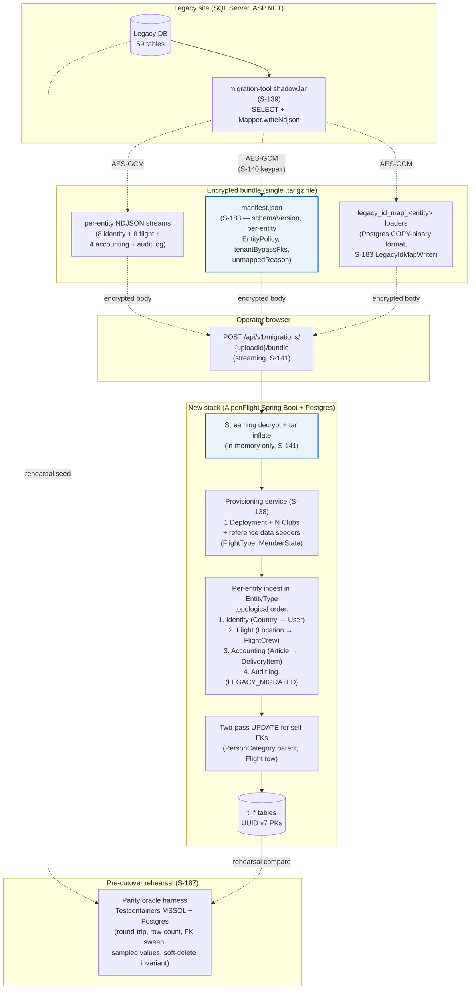

# Legacy database migration plan

Single source of truth for **every legacy SQL Server table and EF entity** and what happens to it in the new stack. One row per legacy artifact (entity ↔ table pair, or framework-managed table with no entity). Exhaustive over the final-state legacy schema (initial EF migration + all `DBUpdate_v*.sql` deltas applied in order — 59 tables, 56 entity classes).

This file is maintained by `/modernize-refine` (Step 4.5). Each story that touches DB schema updates the rows it owns; the diff lands in the same PR as the story's refinement. The story body itself stays silent on per-table migration — readers come here.

## How to read

- **Legacy entity** — EF entity class name under [`flsserver/src/FLS.Server.Data/DbEntities/`](../../flsserver/src/FLS.Server.Data/DbEntities/). `—` when the table is framework-managed (e.g., `TrackerEnabledDbContext` audit tables) and has no application-owned entity class.
- **Legacy table** — name as it appears in the final-state legacy schema (post-DBUpdate). Cross-references: [`flsserver/src/FLS.Server.Data/Migrations/201501222055041_InitialCreate.cs`](../../flsserver/src/FLS.Server.Data/Migrations/201501222055041_InitialCreate.cs) for the baseline; [`flsserver/database/FLS/Updates/`](../../flsserver/database/FLS/Updates/) for the deltas.
- **Destination** — new-stack table name (in the V<N> Flyway migration that creates it) OR `(dropped)` OR `(folded into <table>)` OR `(replaced by <external>)`. `TBD` means no story has refined this row yet.
- **Semantics** — one of: `port-as-rows` · `port-as-schema-only` · `drop` · `fold-into-<table>` · `split-into-<tables>` · `replaced-by-<external-system>`. `TBD` until refined.
- **Owned by** — story ID that wrote / last updated this row. Past owners ride in **Notes** as `also touched by S-XXX`.
- **Notes** — cutover specifics, sacred-cow flags, anything an operator needs at migration time.
- **Detail** — relative link to `legacy-tables/<TableName>/`, a per-table folder containing `_table.json` (entity binding + table-level migration TBD fields) and one `<column>.json` per column (SQL Server metadata + per-column migration TBD fields). Refinement can stamp columns individually when the parent row's semantics isn't uniform.

## Allowed semantics

| Value | Meaning |
|---|---|
| `port-as-rows` | Rows copied 1:1 (column-mapped) by the S-016 importer / S-141 ingest pipeline. |
| `port-as-schema-only` | Table exists in new schema but rows are not copied (e.g. recreated empty per tenant on first use). |
| `drop` | No destination. Legacy rows are not read; the table doesn't exist in the new stack. |
| `fold-into-<table>` | Row contents merged into another aggregate's table (legacy junction → parent's column array, etc.). |
| `split-into-<tables>` | Single legacy table decomposed into N new tables (e.g. inheritance flattened). |
| `replaced-by-<external-system>` | Legacy responsibility moved to a non-DB system (Keycloak, OGN, Proffix). |

If a story needs a semantics value not in this list, add it via refine's Step 3.5 grill and update this header before stamping the row.

## End-to-end migration flow

The diagram covers the end-to-end migration as designed across stories S-016 (skeleton), S-138 (provisioning), S-139 (producer jar), S-140 (encryption keypair), S-141 (ingest pipeline), S-183 (mapper contract + manifest + LegacyIdMapWriter), S-184/S-185/S-186 (per-package mappers), and S-187 (parity oracle rehearsal). The `manifest.json` `TENANT_BYPASS_ALLOW_LIST` and the streaming-decrypt path are the two defense-in-depth surfaces (highlighted) — the manifest gates cross-tenant FK widening at parse, and the decrypt-pipeline ban on disk sinks (ArchUnit) keeps plaintext bytes off local storage.

## Final-state legacy artifacts

> **Bootstrapped 2026-05-26.** Tables queried from the FLSTest fixture in the local `fls-e2e-mssql-1` container (`mcr.microsoft.com/mssql/server:2022-latest`) — the e2e/integration-test seed mirrors the post-DBUpdate prod schema. Entities enumerated from [`flsserver/src/FLS.Server.Data/DbEntities/`](../../flsserver/src/FLS.Server.Data/DbEntities/), with the `DbSet<E> N` map from [`flsserver/src/FLS.Server.Data/FLSDataEntities.cs`](../../flsserver/src/FLS.Server.Data/FLSDataEntities.cs) used to bind each table to its entity class. Per-table column detail under [`legacy-tables/`](./legacy-tables/) was emitted in the same pass. Row list is exhaustive — refine's Step 4.5 updates rows in place, never adds new ones. If a prod-DB extract via [`alpenflight/database/extract/`](../../alpenflight/database/extract/) later reveals a table absent here, treat it as a bootstrap defect and re-sync rather than appending ad-hoc.

| Legacy entity | Legacy table | Destination | Semantics | Owned by | Notes | Detail |
|---|---|---|---|---|---|---|
| AccountingRuleFilter | AccountingRuleFilters | `t_accounting_rule_filter` (V4) | port-as-rows | S-183 | Tenant-scoped; tombstones ported per S-016 ref policy. | [columns](legacy-tables/AccountingRuleFilters/) |
| AccountingRuleFilterType | AccountingRuleFilterTypes | `t_accounting_rule_filter_type` (V4) | port-as-rows | S-183 | SYSTEM_GLOBAL ref; resolves via `legacy_int_id` (S-014). | [columns](legacy-tables/AccountingRuleFilterTypes/) |
| AccountingUnitType | AccountingUnitTypes | `t_accounting_unit_type` (V4) | port-as-rows | S-183 | SYSTEM_GLOBAL ref; resolves via `legacy_int_id` (S-014). | [columns](legacy-tables/AccountingUnitTypes/) |
| AircraftAircraftState | AircraftAircraftStates | `t_aircraft_aircraft_state` (V3) | port-as-rows | S-185 | Inherits cross-tenant from Aircraft (ADR 0008). Composite legacy PK → surrogate UUID v7. Tenant-bypass FK: `noticed_by_person_id` (→ Person). Reference FK: `aircraft_state_id` resolves via `legacy_int_id`. `Manifest.TENANT_BYPASS_ALLOW_LIST` widens. Also touched by S-183. | [columns](legacy-tables/AircraftAircraftStates/) |
| AircraftOperatingCounter | AircraftOperatingCounters | `t_aircraft_operating_counter` (V3) | port-as-rows | S-185 | Per-aircraft counter readings; inherits cross-tenant from Aircraft. Only FK is intra-aggregate `aircraft_id`; declares empty `tenantBypassFks`. Also touched by S-183. | [columns](legacy-tables/AircraftOperatingCounters/) |
| AircraftReservation | AircraftReservations | `t_aircraft_reservation` (V4) | port-as-rows | S-183 | Tenant-scoped reservation rows. | [columns](legacy-tables/AircraftReservations/) |
| AircraftReservationType | AircraftReservationTypes | `t_aircraft_reservation_type` (V4) | port-as-rows | S-183 | TENANT_SCOPED ref; ports via per-bundle map. | [columns](legacy-tables/AircraftReservationTypes/) |
| Aircraft | Aircrafts | `t_aircraft` (V3 + V10) | port-as-rows | S-185 | Cross-tenant entity per ADR 0008 / V10 + S-058 amendment. Producer cascade for `managing_club_id` NOT NULL: legacy `OwnerClubId` → single-`PersonClub`-of-`AircraftOwnerPersonId` in bundle → drop+warn `AIRCRAFT_NO_MANAGING_CLUB`. Tenant-bypass FKs: `aircraft_owner_person_id` (→ Person), `homebase_id` (→ tenant-scoped Location). Mapper-side `spot_link` https reject. `Manifest.TENANT_BYPASS_ALLOW_LIST` widens to include AIRCRAFT. Also touched by S-183 (registry scaffold), S-159 (V10). | [columns](legacy-tables/Aircrafts/) |
| AircraftState | AircraftStates | `t_aircraft_state` (V3) | port-as-rows | S-183 | SYSTEM_GLOBAL ref; resolves via `legacy_int_id` (S-013). | [columns](legacy-tables/AircraftStates/) |
| AircraftType | AircraftTypes | `t_aircraft_type` (V3) | port-as-rows | S-183 | SYSTEM_GLOBAL ref; resolves via `legacy_int_id` (S-013). | [columns](legacy-tables/AircraftTypes/) |
| Article | Articles | `t_article` (V4) | port-as-rows | S-183 | Catalog item; tenant-scoped. | [columns](legacy-tables/Articles/) |
| — | AuditLogDetails | (dropped) | drop | S-183 | Framework-managed by legacy `TrackerEnabledDbContext`; superseded by S-027's `t_mutation_audit_event`. Manifest WHY-not-mapped. | [columns](legacy-tables/AuditLogDetails/) |
| — | AuditLogEventTypes | (dropped) | drop | S-183 | Framework-managed; superseded by S-027 `action` enum. Manifest WHY-not-mapped. | [columns](legacy-tables/AuditLogEventTypes/) |
| — | AuditLogs | `t_mutation_audit_event` (V9) | port-as-rows | S-183 | Mapper emits `actor_kind='LEGACY_MIGRATED'` + `legacy_actor_user_id` + NULL `actor_keycloak_sub`. Orphan refs → synthetic UUID v7 (one per distinct legacy actor per bundle) + `migration_run.warnings`. S-027 read-back coverage added per S-186 hand-off. | [columns](legacy-tables/AuditLogs/) |
| ClubExtension | ClubExtensions | `t_club_extension` (V2) | port-as-rows | S-183 | Per-club extension-type enablement; legacy `Extensions` master table is dropped. | [columns](legacy-tables/ClubExtensions/) |
| Club | Clubs | `t_club` (V5) | port-as-rows | S-184 | Tenant root; 1..N Clubs per Deployment per S-138. FKs: Country (SYSTEM_GLOBAL), ClubState (SYSTEM_GLOBAL). `OwnerPersonId` set NULL at first pass; S-141 resolves in second pass after Person ingest. Renamed `t_club` per S-170. Also touched by S-048 (walking skeleton). | [columns](legacy-tables/Clubs/) |
| ClubState | ClubStates | `t_club_state` (V2) | port-as-rows | S-184 | SYSTEM_GLOBAL_RESOLVE via `code` lookup against V2 seeds — V2 carries no `legacy_int_id` on `t_club_state`. Legacy `0=System` is dropped (system-row policy); `1=Active → ACTIVE`, `2=Passiv → CLOSED`, `3=Inactive → SUSPENDED`. | [columns](legacy-tables/ClubStates/) |
| CounterUnitType | CounterUnitTypes | `t_counter_unit_type` (V2) | port-as-rows | S-183 | SYSTEM_GLOBAL ref; resolves via `legacy_int_id` (S-012). | [columns](legacy-tables/CounterUnitTypes/) |
| Country | Countries | `t_country` (V2) | port-as-rows | S-183 | SYSTEM_GLOBAL ref; resolves via `legacy_int_id` (S-012). Sample mapper shipped in S-016. | [columns](legacy-tables/Countries/) |
| Delivery | Deliveries | `t_delivery` (V4) | port-as-rows | S-183 | Invoice delivery; Swiss OR Art. 957a retention — tombstones ported per S-016 ref. | [columns](legacy-tables/Deliveries/) |
| DeliveryCreationTest | DeliveryCreationTests | `t_delivery_creation_test` (V4) | port-as-rows | S-183 | Splits into `t_delivery_creation_test` (root) + `t_delivery_creation_test_item` (line items) — legacy stored both in one table; new schema separates. | [columns](legacy-tables/DeliveryCreationTests/) |
| DeliveryItem | DeliveryItems | `t_delivery_item` (V4) | port-as-rows | S-183 | Delivery line items; tombstones ported (invoice retention). | [columns](legacy-tables/DeliveryItems/) |
| ElevationUnitType | ElevationUnitTypes | `t_elevation_unit_type` (V2) | port-as-rows | S-183 | SYSTEM_GLOBAL ref; resolves via `legacy_int_id` (S-012). | [columns](legacy-tables/ElevationUnitTypes/) |
| EmailTemplate | EmailTemplates | `t_email_template` (V2) | port-as-rows | S-183 | Tenant-scoped templates. | [columns](legacy-tables/EmailTemplates/) |
| Extension | Extensions | (dropped) | drop | S-183 | Legacy .NET DLL-extension plugin manifest (`ExtensionClassName` / `ExtensionDllFilename` / `ExtensionDllPublicKey`) — irrelevant to the Java rewrite. Manifest WHY-not-mapped. | [columns](legacy-tables/Extensions/) |
| ExtensionType | ExtensionTypes | `t_extension_type` (V2) | port-as-rows | S-183 | SYSTEM_GLOBAL ref; resolves via `legacy_int_id` (S-012). | [columns](legacy-tables/ExtensionTypes/) |
| ExtensionValue | ExtensionValues | `t_extension_value` (V2) | port-as-rows | S-183 | Per-instance extension values; tenant-scoped via parent FK. | [columns](legacy-tables/ExtensionValues/) |
| FlightAirState | FlightAirStates | (dropped) | drop | S-183 | V13 dropped destination — air state is computed not stored per ADR 0022 D2 (S-060). Flight mapper translates legacy `Flight.AirStateId == FlightPlanOpen` → `t_flight.flight_plan_opened_on` timestamp; other legacy air-state values dropped. Manifest WHY-not-mapped. | [columns](legacy-tables/FlightAirStates/) |
| FlightCostBalanceType | FlightCostBalanceTypes | `t_flight_cost_balance_type` (V4) | port-as-rows | S-183 | SYSTEM_GLOBAL ref per S-138 deviation note; resolves via `legacy_int_id` (S-014). | [columns](legacy-tables/FlightCostBalanceTypes/) |
| FlightCrew | FlightCrew | `t_flight_crew` (V3) | port-as-rows | S-185 | **JMH-benched mapper (S-188)** — allocation discipline: no per-row allocation beyond Jackson + JDBC inherent. Tenant-bypass FK: `person_id` (→ cross-tenant Person). Reference FK: `flight_crew_type_id` via `legacy_int_id`. Budget ≥ 200K rows/sec / ≤ 50 MB/s alloc. `Manifest.TENANT_BYPASS_ALLOW_LIST` widens. Also touched by S-183. | [columns](legacy-tables/FlightCrew/) |
| FlightCrewType | FlightCrewTypes | `t_flight_crew_type` (V3) | port-as-rows | S-183 | SYSTEM_GLOBAL ref; resolves via `legacy_int_id` (S-013). | [columns](legacy-tables/FlightCrewTypes/) |
| FlightProcessState | FlightProcessStates | `t_flight_process_state` (V3) | port-as-rows | S-183 | SYSTEM_GLOBAL ref; resolves via `legacy_int_id` (S-013). | [columns](legacy-tables/FlightProcessStates/) |
| Flight | Flights | `t_flight` (V3 + V13) | port-as-rows | S-185 | Tenant-scoped via `operating_club_id`; tombstones ported. **V13 air-state translation**: `AirStateId == FlightPlanOpen(5)` → `flight_plan_opened_on = ModifiedOn`; other legacy values → NULL. `flight_aircraft_type_id` SMALLINT passes through — sparse-enum (1,2,4) guard lives on Flight aggregate (S-058) per ADR 0022 D2. Self-FK `tow_flight_id` deferred to S-141 two-pass UPDATE (PersonCategory precedent). Tenant-bypass FK: `aircraft_id` (→ cross-tenant Aircraft). `Manifest.TENANT_BYPASS_ALLOW_LIST` widens. Also touched by S-183, S-060 (V13). | [columns](legacy-tables/Flights/) |
| FlightType | FlightTypes | `t_flight_type` (V3) | port-as-rows | S-185 | TENANT_SCOPED ref; ports via per-bundle map; S-138 per-Club seed wins on `(operating_club_id, flight_type_name)` collision (legacy FK resolves to seeded UUID via natural-key lookup). No tenant bypass. Also touched by S-183, S-138. | [columns](legacy-tables/FlightTypes/) |
| InOutboundPoint | InOutboundPoints | `t_inoutbound_point` (V3) | port-as-rows | S-183 | Per-flight in/out points; aggregate-internal under Location per S-024. | [columns](legacy-tables/InOutboundPoints/) |
| Language | Languages | `t_language` (V2) | port-as-rows | S-184 | SYSTEM_GLOBAL_RESOLVE via `code` lookup against V2 seeds — V2 carries no `legacy_int_id` on `t_language`; bundle emits `(legacy_guid, LOWER(LanguageKey))`. Drift past V2 seed fails closed as `BUNDLE_LANGUAGE_NOT_SEEDED`. | [columns](legacy-tables/Languages/) |
| LanguageTranslation | LanguageTranslations | (dropped) | drop | S-183 | i18n owned by the Angular client per ADR 0004; server-side translation table superseded. Manifest WHY-not-mapped. | [columns](legacy-tables/LanguageTranslations/) |
| LengthUnitType | LengthUnitTypes | `t_length_unit_type` (V2) | port-as-rows | S-183 | SYSTEM_GLOBAL ref; resolves via `legacy_int_id` (S-012). | [columns](legacy-tables/LengthUnitTypes/) |
| Location | Locations | `t_location` (V3 + V7) | port-as-rows | S-185 | Tenant-scoped via `club_id NOT NULL` per V7 (supersedes pre-V7 cross-tenant note). Producer **fans out one bundle row per (legacy Location, referencing Club)** with fresh UUID v7 per replica; referencing-Club set = `Flights.{StartLocationId, LdgLocationId}` ∪ `Clubs.HomebaseId` ∪ `Aircrafts.HomebaseId` (by managing_club_id). `legacy_id_map_location` is composite-keyed `(legacy_guid, club_id)` — S-141 temp-table DDL change. FK resolution: pick replica whose `club_id` matches the source's operating/managing club; lowest-UUID fallback. LOCATION does NOT join `Manifest.TENANT_BYPASS_ALLOW_LIST` (tenant-scoped). Also touched by S-183 (registry scaffold), S-049b (V7). | [columns](legacy-tables/Locations/) |
| LocationType | LocationTypes | `t_location_type` (V3) | port-as-rows | S-183 | SYSTEM_GLOBAL ref; resolves via `legacy_int_id` (S-013). | [columns](legacy-tables/LocationTypes/) |
| MemberState | MemberStates | `t_member_state` (V2) | port-as-rows | S-184 | TENANT_SCOPED ref; ports via per-bundle map; S-138 per-Club seed runs as no-op for ported states (bundle-wins via `ux_member_state_club_name`). | [columns](legacy-tables/MemberStates/) |
| PersonCategory | PersonCategories | `t_person_category` (V2) | port-as-rows | S-184 | Per-Club category definitions; ports via per-bundle map. Self-FK `ParentPersonCategoryId` resolves via two-pass UPDATE (no DEFERRABLE on the V2 constraint). | [columns](legacy-tables/PersonCategories/) |
| PersonClub | PersonClub | `t_person_club` (V2) | port-as-rows | S-184 | Person↔Club junction; surrogate UUID v7 PK (legacy composite collapses); Person FK is cross-tenant — declared in `tenantBypassFks`. No `legacy_id_map_person_club` (leaf junction). Boolean role flags derived from legacy `Person.Has*Licence` projected to per-club scope. | [columns](legacy-tables/PersonClub/) |
| PersonFlightTimeCredit | PersonFlightTimeCredits | (dropped) | drop | S-183 | Per `UnmappedTables.REGISTRY` — feature retired; balance never materialised into a new flight-credit aggregate. Manifest WHY-not-mapped. | [columns](legacy-tables/PersonFlightTimeCredits/) |
| PersonFlightTimeCreditTransaction | PersonFlightTimeCreditTransactions | (dropped) | drop | S-183 | Per `UnmappedTables.REGISTRY` — transaction history retired alongside parent. Manifest WHY-not-mapped. | [columns](legacy-tables/PersonFlightTimeCreditTransactions/) |
| PersonPersonCategory | PersonPersonCategories | `t_person_category_assignment` (V17) | port-as-rows | S-184 | Per-Club person↔category association. New V17 migration adds `t_person_category_assignment(id UUID PK, person_id UUID FK, person_category_id UUID FK, club_id UUID FK)`. New `EntityType.PERSON_CATEGORY_ASSIGNMENT`. Cross-tenant Person FK in `tenantBypassFks`. | [columns](legacy-tables/PersonPersonCategories/) |
| Person | Persons | `t_person` (V2) | port-as-rows | S-184 | Cross-tenant entity per ADR 0008; per-bundle cross-tenant sub-map drives FK rewrites (S-141 AC10). Only outgoing FK is Country (SYSTEM_GLOBAL, no bypass needed). S-024 exemption add owned by S-186. | [columns](legacy-tables/Persons/) |
| PlanningDayAssignment | PlanningDayAssignments | `t_planning_day_assignment` (V4) | port-as-rows | S-183 | Tenant-scoped planning roles. | [columns](legacy-tables/PlanningDayAssignments/) |
| PlanningDayAssignmentType | PlanningDayAssignmentTypes | `t_planning_day_assignment_type` (V4) | port-as-rows | S-183 | TENANT_SCOPED ref; ports via per-bundle map. | [columns](legacy-tables/PlanningDayAssignmentTypes/) |
| PlanningDay | PlanningDays | `t_planning_day` (V4) | port-as-rows | S-183 | Tenant-scoped planning calendar. | [columns](legacy-tables/PlanningDays/) |
| Role | Roles | (dropped) | drop | S-184 | Added to `UnmappedTables.REGISTRY` + removed from `EntityType` (retroactive S-183 edit). Realm-role catalog lives in Keycloak per ADR 0007; the legacy seed (ADMIN/FLIGHT_OPS/INSTRUCTOR/PILOT/READER) doesn't even match the realm catalog. Importer ignores legacy rows. Also touched by S-052. | [columns](legacy-tables/Roles/) |
| Setting | Settings | (dropped) | drop | S-183 | Per `UnmappedTables.REGISTRY` — per-club KV config moved to typed `ClubSettings` aggregate / env config; legacy KV store not ported. Manifest WHY-not-mapped. S-024 exemption list adds system tables. | [columns](legacy-tables/Settings/) |
| StartType | StartTypes | `t_start_type` (V2) | port-as-schema-only | S-185 | SYSTEM_GLOBAL_RESOLVE via `code` lookup against V2 seeds (LanguageMapper pattern; V2 carries no `legacy_int_id` on `t_start_type`). Legacy PK is INT identity (not UUID); mapper emits `(legacy_guid_synth_uuid, code)` pairs — table rows are NOT row-ported. Legacy `IsFor*Flights` boolean trio dropped (V2's `applicable_categories TEXT[]` per ADR 0020 owns the categorisation). Also touched by S-183. | [columns](legacy-tables/StartTypes/) |
| SystemData | SystemData | (dropped) | drop | S-183 | Per `UnmappedTables.REGISTRY` — runtime/process metadata superseded by Spring Boot Actuator + ops tooling. Manifest WHY-not-mapped. | [columns](legacy-tables/SystemData/) |
| SystemLog | SystemLogs | (dropped) | drop | S-183 | Per `UnmappedTables.REGISTRY` — replaced by structured logging stack (no DB target). Manifest WHY-not-mapped. | [columns](legacy-tables/SystemLogs/) |
| SystemVersion | SystemVersion | (dropped) | drop | S-183 | Per `UnmappedTables.REGISTRY` — replaced by Flyway `flyway_schema_history`. Manifest WHY-not-mapped. | [columns](legacy-tables/SystemVersion/) |
| UserAccountState | UserAccountStates | (dropped) | drop | S-052 | KC `enabled` flag + `deleted_on` cover the states. Importer ignores legacy rows. | [columns](legacy-tables/UserAccountStates/) |
| UserRole | UserRoles | (dropped) | drop | S-184 | Added to `UnmappedTables.REGISTRY` + removed from `EntityType` (retroactive S-183 edit). Roles live in Keycloak realm-roles per ADR 0007. Importer maps legacy role names to KC realm roles at S-028 provisioning without persisting the junction. Also touched by S-052. | [columns](legacy-tables/UserRoles/) |
| User | Users | `t_user` (V2) | port-as-rows | S-184 | FKs: Club, Person (cross-tenant per S-141 AC10), Language (SYSTEM_GLOBAL). System actor row `13731ee2-c1d8-455c-8ad1-c39399893fff` dropped at producer (system-row policy); refs re-routed to S-186 orphan-actor synthesis. Password + KC-shadow deny-list: `Password`, `LastPasswordChangeOn`, `ForcePasswordChangeNextLogon`, `FailedLoginCounts`, `AccountState` NOT carried in bundle. `keycloak_sub` minted by S-028 bulk-provision (NULL on ingest). Created as `t_user` at S-052 (Postgres reserved-word collision); S-170 retroactively brought every other AlpenFlight table under the same convention. | [columns](legacy-tables/Users/) |

## Coverage check

A future story (or a one-shot script) should grep `_ORDER.md` against this file and assert every story that lists a `flsserver/database` path or names a legacy table in its acceptance has stamped the corresponding rows here. Until then, an operator's eyeball is the check — rows still showing `TBD` after their owning story has merged are bugs.
